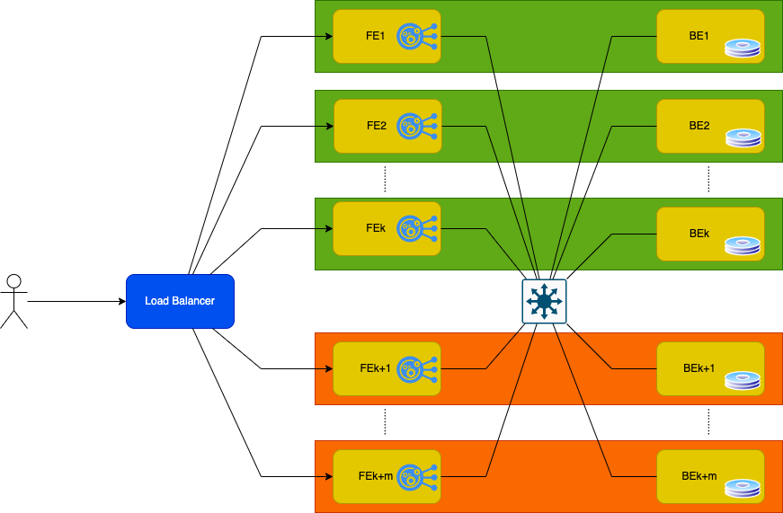

# Small File Management in Erasure-Coded SANs
_minimizing overhead, maximizing efficiency_

---

## What is a Storage Area Network (SAN)?

* **Item 1** (Item1 description)
* **Item 2** (Item2 description)
* **...** (...)

---

## Performance Factors

* **network** - ....
* **CPU** - .....
* **native file system** - .....
* **administration** - .....

---

<!-- .slide: data-transition="convex-in none-out" -->

---

<!-- .slide: data-transition="fade-in none-out" -->

---

<!-- .slide: data-transition="fade-in convex-out" -->

---

## Researches on Performance Improvements
_Related Works_

* **Citation1**
* **Citation2**
* **Citation3**
* **Citation4**
* **Citation5**

---

# 4 - MicroK8s
_[https://microk8s.io/](https://microk8s.io/)_

* **Developed by Canonical**
* **CNCF certified**
* **Multi-node-cluster** - `microk8s add-node`, then start new VM
* **Container runtime** - containerd,kata
* **Networking** - Calico
* **Based on [Multipass](https://multipass.run/docs)**

---

# Summary

|               | Default  | OS Image       | Container Runtime   | Memory       |
|---------------|----------|----------------|---------------------|--------------|
| **Minikube**  | v1.23.3  | Ubuntu 20.04.2 | docker://20.10.12   |  1G + 300M   |
| **Docker D**  | v1.24.0  | Alpine v3.15   | docker://20.10.14   |  2 GB        |
| **Rancher D** | v1.23.6  |                | containerd://1.5.11 |  2 GB        |
| **MicroK8S**  | v1.24.0  |   ---          | containerd://1.5.11 |              |
| **KIND**      | v1.24.0  | Ubuntu 21.10   | containerd://1.6.4  |  1G + 200M   |
| **K3D**       | v1.21.12 | Alpine v3.16   | containerd://1.4.13 |  800M + 200M |
| **K0S**       | v1.23.6  | Alpine v3.13   | containerd://1.5.11 |  1.3G + 256M |

---

# 👍 _Thank You_ 👍

